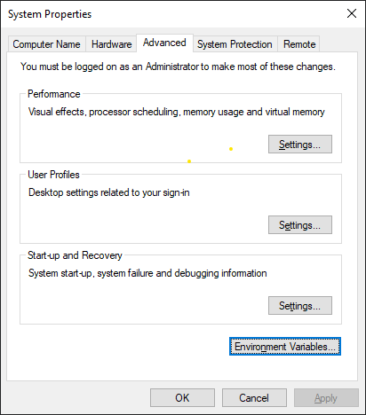
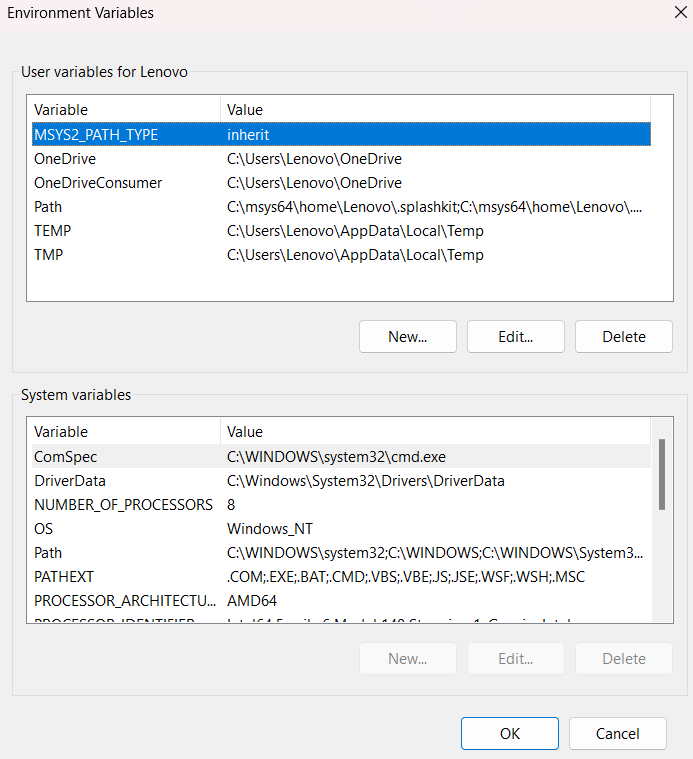
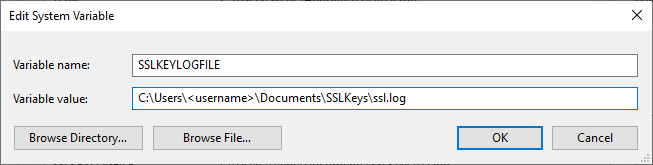

# Finals Key Extractor

> This project is not affiliated or approved by Embark. Any use of this software is at your own risk.

## Requisites

1. Install Python 3.10
2. Install Wireshark to `C:\Program Files\Wireshark` (should be the default install directory)
   2. if you're installing in a different directory, you need to change the path in the `config.ini` file
3. [Setup SSLKEYLOG file](#setup-sslkeylog-file)

## Setup

1. Either clone the repository using git or download it
2. Run it

```shell
python3 main.py
```

3. After running it, it will promt you to select an interface. Select the interface that you're connected to the internet with. Wi-Fi if using Wi-Fi, Ethernet if using a cable.
4. Open up The Finals and the program should start capturing data.

## Output

### `Stats file captured`

This means that the program has captured all the data needed to fill the stats file. This file is saved in the project root as `stats.json`

## Config

| Key              |  type  | Default                                  | Description                                                                    |
|------------------|:------:|------------------------------------------|--------------------------------------------------------------------------------|
| tshark.path      | String | C:\\Program Files\\Wireshark\\tshark.exe | Path to the tshark file, change this if you have a different installation path |
| tshark.interface | Number | Null                                     | Interface tshark will listen on                                                |

### Debug

This is debug config, mainly used for development

| Key            |  type   | Default | Description                                                              |
|----------------|:-------:|---------|--------------------------------------------------------------------------|
| debug.save_raw | Boolean | False   | Set this to true if you want to save raw responses to `responses` folder |
| debug.log      | Boolean | False   | Set this to true if you want to enable debug logging                     |
|                |         |         |                                                                          |


Internally this project uses tshark or [Terminal-based Wireshark](https://www.wireshark.org/docs/wsug_html_chunked/AppToolstshark.html) to listen to the traffic on your network and then decrypts that traffic using `SSLKEYLOGFILE`.

It then waits until it can hear traffic belonging to embark. When it detects that a request belonging to embark has been made, it reads the response and saves it into `stats.json` file.

## Setup SSLKEYLOG file

1. Press WIN, type in `Edit the system environment variables` and press ENTER.



2. Press on `Environment Variables...`.



3. Under the `System variables` section press on new, set variable name as `SSLKEYLOGFILE` and value as any valid path to file. As an example `C:\Users\<username>\Documents\SSLKeys\ssl.log`



4. Press OK and restart your computer.
5. After restart make sure that the document has been generated and has text.
